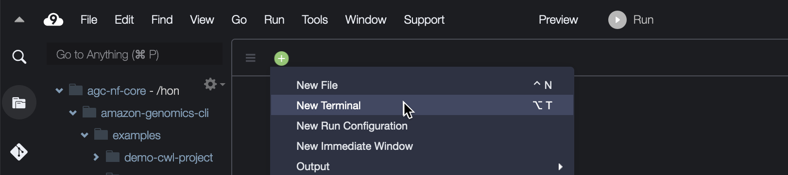

===================
Amazon Genomics CLI
===================

.. _launch-constraint:

We will be running the workshop `Amazon Genomics CLI <https://catalog.workshops.aws/agc-pipelines/en-US>`_ to install the Amazon Genomics CLI, then run a sample workflow.  All work will be done from within an AWS Cloud9 instance, which provides a terminal environment integrated with a file explorer and text editor.  

Today we will do only the **Getting Started** and **WDL Pipeline (Option 2)** sections.  All actions necessary to deploy and run the workflow can be performed from the command line of the Cloud9 environment, though we will also visit the AWS Console to examine the resources and processes of the workflow.

Follow the instructions in sequence, and there are some notes below relevant to the various steps.

----------------------------------
Getting Started → Cloud9 Disk Size
----------------------------------

To access the command line in Cloud9, click the green '+' icon and select 'New Terminal'.

